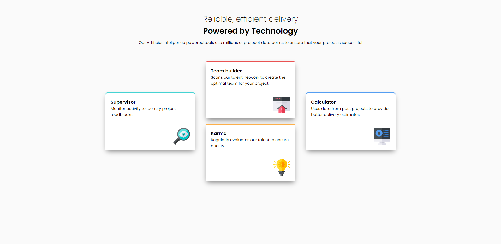
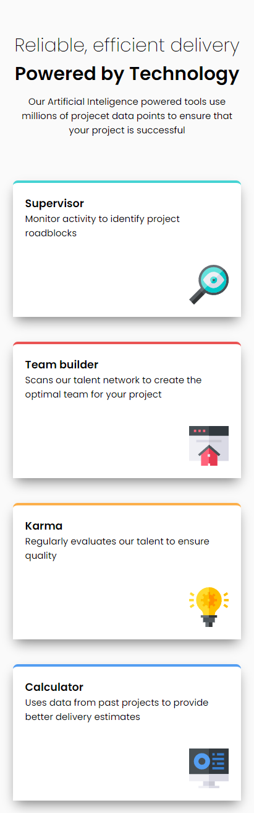

## Overview

Another project about layouting CSS and maximizing flexbox
now its about feature card.

### The challenge

Users should be able to:

- View the optimal layout for the site depending on their device's screen size

### Screenshot

DESKTOP-VIEW

MOBILE-VIEW

### Links

- Live Site URL: [https://upbeat-johnson-b77f18.netlify.app/](https://your-live-site-url.com)

## My process

Basic HTML CSS

### Built with

- Semantic HTML5 markup
- CSS custom properties
- Flexbox

### What I learned

I found creating all the HTML is way so much better rather than doing HTML for 1 section and then do the CSS
layout roughly all the component in the website then do the css after that

### Continued development

I will move to another project based on CSS grid, then tomorrow learning about JavaScript

**Note: Delete this note and the content within this section and replace with your own plans for continued development.**

## Author

- Frontend Mentor - [@althafdaa]
